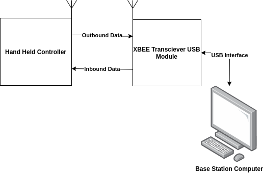

# Wireless-Modular-Haptic-Controller
A small, flexible and modular wireless haptic controller for mobile manipulator control. This project attempts to take the rudimentary controller design implemented [here](https://github.com/sherrardTr4129/RealSense-BNO055-Pose-Estimation), and add a more complex feature set. Multiple controllers can be used on the same mesh network to create more intuitive human-robot interfaces. Ultimately, the goal of this project is to create a configuration of controllers to provide dexterous control of a mobile manipulator system. 

## Demo Video
Have a look at the system in action! The video below shows a single controller being used for controlling the locobot base with adaptive scaling control. 

## High Level System Architecture
The system is comprised of a single base-station node, and several controller nodes. The base-station node serves as the entry point into the network and coordinates the setup of the overall mesh network (coordinator node). A ROS driver manages data transactions between the ROS infrastructure and the controller mesh network via a serial interface with the coordinator node. The mesh network itself is comprised of XBee modules attached to each controller. These provide a high level of configurability for a relatively low price. Have a look at the data flow diagram below for a simplified explanation of the system's base configuration. 

