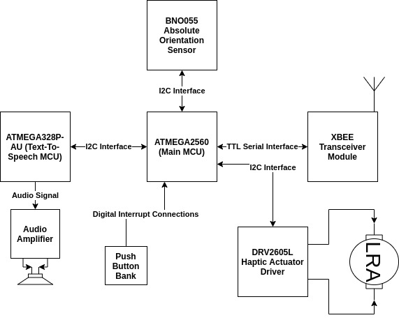
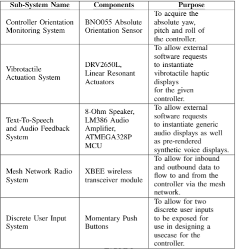
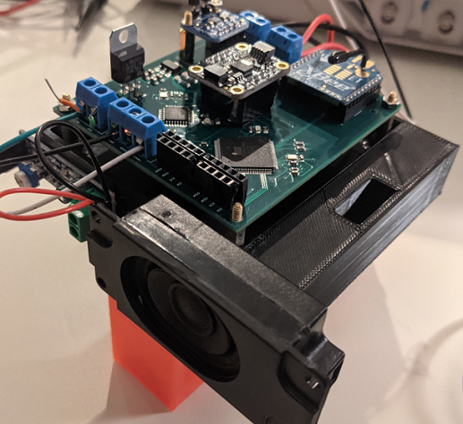
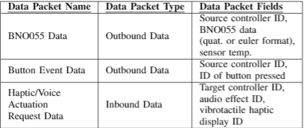

# Wireless-Modular-Haptic-Controller
A small, flexible and modular wireless haptic controller for mobile manipulator control. This project attempts to take the rudimentary controller design implemented [here](https://github.com/sherrardTr4129/RealSense-BNO055-Pose-Estimation), and add a more complex feature set. Multiple controllers can be used on the same mesh network to create more intuitive human-robot interfaces. Ultimately, the goal of this project is to create a configuration of controllers to provide dexterous control of a mobile manipulator system. 

## Demo Video
Have a look at the system in action! The video below shows a single controller being used for controlling the locobot base with adaptive scaling control. 

## Single Controller Architecture
A given single controller offers much more sensing and actuation capability as compared to the controller design implemented [here](https://github.com/sherrardTr4129/RealSense-BNO055-Pose-Estimation). In this design, each controller acts as a node on a larger mesh network. This allows for ease of addition and subtraction of nodes from said network, depending on the desired HRI configuration. Each controller has the ability to deliver audio (including basic TTS) and vibrotactile feedback to the user. In addition, the controller still contains a BNO055 sensor to extract the orientation of the controller itself in three dimensional space. Each given controller also has two momentary push buttons for user input. Please see the figure below for a graphical depicition of the controller architecture. 

The table below contains a more in-depth explaination of the individual controller architecture, including each sub-system's components.

Once the controller is completely assembled, it should look something like the controller in the figure below. 

## High Level System Architecture
The system is comprised of a single base-station node, and several controller nodes. The base-station node serves as the entry point into the network and coordinates the setup of the overall mesh network (coordinator node). A ROS driver manages data transactions between the ROS infrastructure and the controller mesh network via a serial interface with the coordinator node. The mesh network itself is comprised of wireless XBee modules attached to each controller. These provide a high level of configurability for a relatively low price. Have a look at the data flow diagram below for a simplified explanation of the system's base configuration. 

A brief explanation of the inbound and outbound data types referenced in the above diagram can be seen in the table below.

More controller nodes can be added to the network as needed based on the desired human-robot interface configuration. All data is transmitted in broadcast mode. That is, each node on the network will recieve data transmitted from any individual node. This was done to avoid having to set up direct addressing, and thus increasing the flexibility and ease of setup for the system. Data packets transmitted from a given node are formatted in JSON. One of the JSON fields in any given data packet format is the desired recipient of the data packet. This allows nodes on the network to quickly discern whether to process a given data packet or not using the aforementioned broadcast transmission mode.
