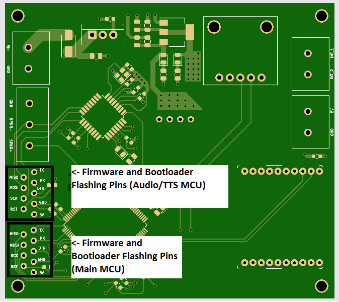

# Controller Firmware Design
This sub-directory contains the firmware developed for the two processors on the hand-held controller. Please see below for notes about each MCU's firmware and the procedure to flash the firmware onto each of the MCU's. 

## Firmware Dependencies 
This section will breifly outline the different firmware dependencies within this project. Please note that all firmware dependencies are obtainable through the arduino software manager. 

### Main Controller Firmware Dependencies
* **Adafruit Sensor Library** - This library provides general functionallity required for the two onboard adafruit sensors.
* **Adafruit BNO055 Library** - This library provides functionallity needed to read data from the onboard BNO055 sensor via an I2C interface. 
* **Adafruit DRV2605 Library** - This library provides functionallity needed to interface with the DRV2605 driver board via an I2C interface.
* **ArduinoJson** - This library provides JSON document construction functionallity and functionallity to serialize said documents via the XBee wireless interface. 

### Text-To-Speech Controller Firmware Dependencies
* **Talkie** - This library provides rudimentary TTS functionallity utilizing the onboard MCU TIMER1 and TIMER2 peripherals. 

## Main Controller Firmware
The main controller firmware is designed to run on the ATMEGA2560 processor on the PCB. Its main purpose is to actuate audio-haptic displays based on requests received by the basestation, and to transmit data from the onboard BNO055 sensor back to the basestation. Outside of the main\_controller\_firmware.ino file, two other software packages are provided. The first is the BSP, which provides functionallity required to initialize and manage all onboard actuators and sensors. The second is the inbound and outbound data stream managers. These classes are designed to unpack incomming request JSON packets from the basestation and package and serialize BNO055 data JSON packets respectively. 

For each controller on the network, two lines of code need to be examined and potentially changed at compile time within the main\_controller\_firmware.ino file. The first is:

```C
bool usingEuler = true;
```
This boolean flag will setup the BNO55 sensor in euler angle mode if true, and quaternion mode if false. The outbound JSON document will be set up differently depending on the state of this variable as well. The second line to examine is:

```C
const char* controller_name = "right_hand";
```
This line defines the given controller's name. The controller name is an important field in all inbound and outbound JSON packets. For outbound data, the controller\_name field is used to determine the origin of the recieved BNO055 data packet. For inbound data, the recieved data packet needs to have the controller\_name field value equivalent to the name set in the above line of code for it to be processed by a given controller. Please ajdust this line accordingly based on the desired HRI configuration.

## Text-To-Speech Controller Firmware
The Text-To-Speech controller firmware is designed to be run on the ATMEGA328P-AU processor on the PCB. It's main purpose is to accept requests to play pre-rendered TTS audio events via the I2C interface managed by the main controller. The I2C transaction is simple, as it requires a single integer number between 0 and 4 corresponding to one of the aforementioned TTS events. The TTS events are instantiated through the use of the Talkie library. If the included vocabularies within the Talkie library do not suit your needs, there are [tutorials](https://github.com/ptwz/python_wizard) on how to render new TTS events.

## Bootloader and Firmware Flashing Proceedure
The pins on the PCB itself needed to flash the bootloader and respective firmware can be seen highlighted in the image below:



### Bootloader Flashing 
After assembling a new board mechanically and electrically, the appropriate bootloader needs to be flashed to each respective MCU. The easist way to do this is to use a seperate arduino uno as an ICSP device. Please follow the tutorial outlined [here](https://www.electronics-lab.com/project/installing-the-arduino-bootloader-on-the-atmega328p-microcontroller/) to flash the bootloader onto each respective MCU using an arduino uno as an ICSP. Please note that this tutorial assumes the target chip is an ATMEGA328P, which is true for the TTS MCU, but not for the main MCU. Make sure to change the board type to "ATmega2560" when flashing the bootloader to the main MCU.

### Firmware Flashing
To flash the firmware on each respective MCU, a USB->TTL Serial converter is required. I made use of the converter found [here](https://www.amazon.com/HiLetgo-FT232RL-Converter-Adapter-Breakout/dp/B00IJXZQ7C/ref=sr_1_2_sspa?crid=23L8XQKO9AP5J&dchild=1&keywords=usb+to+ttl+serial+adapter&qid=1629733622&sprefix=usb+to+ttl+ser%2Caps%2C194&sr=8-2-spons&psc=1&spLa=ZW5jcnlwdGVkUXVhbGlmaWVyPUExMjNWOUZWT1o5Q1NLJmVuY3J5cHRlZElkPUEwNjY1MjA1MVhKMEgwTkRMRUROSCZlbmNyeXB0ZWRBZElkPUEwMjM2Mjg2MTBUOVoxVlhDV0hUWSZ3aWRnZXROYW1lPXNwX2F0ZiZhY3Rpb249Y2xpY2tSZWRpcmVjdCZkb05vdExvZ0NsaWNrPXRydWU=) In my development efforts. In the case of either MCU, the connections between the USB->TTL Serial converter and the board need to be made as described below:

| Firmware Flashing Pin | USB<->TTL Serial Converter Pin |
|-----------------------|--------------------------------|
| GND                   | GND                            |
| TX                    | RX                             |
| RX                    | TX                             |
| DTR                   | DTR (through 100nF capacitor)  |

Please make sure to change the programmer from "Arduino as ISP" used in the last step back to "AVRISP MKll" before trying to upload any firmware.

## XBee Radio Configuration
