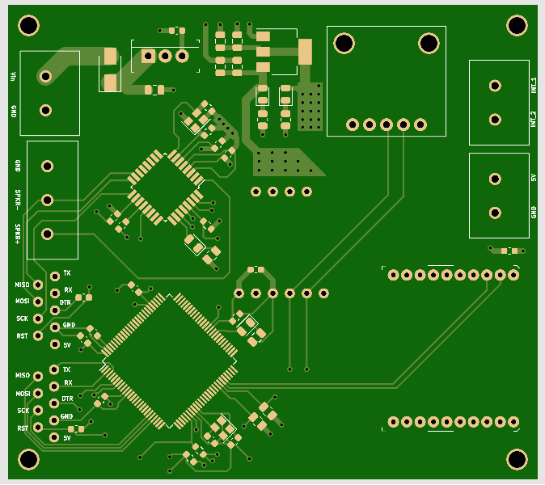
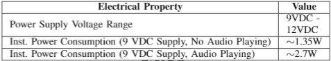

# Electrical Hardware Design
This sub-directory contains the KiCAD project used to generate the GERBERs needed to manufactor the PCB for the haptic controller. An overview of the PCB design and system BoM can be seen in the sections below.

## PCB Design
The PCB for the controller itself was attempted to be designed to be as modular as possible. For example, each of the sensors and actuators can be dynamically populated and de-populated based on the needs of the given controller within the HRI configuration being constructed. A picture of the bare PCB can be seen in the image below. 

The overall controller is powered off of a 9V battery, but can handle input voltages up to 12V. Some of the other electical charictoristics of the controller can be seen within the table in the figure below.

## System Bill Of Materials
