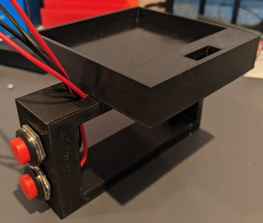

# Mechanical Hardware Design
The mechanical designs for this project were designed under a modularity paradigm. That is, the base that the controller PCB is installed in is designed to be attached to a hand-held controller, haptic belt, or other mounting location depending on the desired HRI configuration. In addition to the controller base, a hand-held glove was also designed to allow for easy interfacing with the controller itself. The controller base and hand-held glove assembly (with push buttons installed) can be seen in the figure below.

The controller base is designed to allow for an optional vision target to be installed. This vision target will allow for the extraction of the controller's position in 3D space to be extracted through the use of a depth camera. Please have a look at the figure below depicting the controller base and hand-held glove assembly (with push buttons installed) along with the optional vision target.

